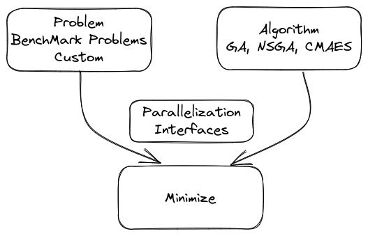

# MPO: Massively Parallel Optimizations with PyMoo and Dask
This is a proof of concept repository for integration of pymoo with dask for running massively parallel optimization problems.

## Background
pymoo is a multi-objective optimization framework for Python. It provides a unified interface for different optimization algorithms and problem definitions. It is also possible to define custom optimization problems and algorithms. The framework is designed to be easily extensible and to provide a simple interface for the user.

This library is a thin wrapper around pymoo to allow for experimentation with massively parallel optimization problems. It uses dask to distribute the optimization problem to multiple workers.

The overall architecture of pymoo is as follows:



**Note**: This is a proof of concept and is not intended for production use.

For setting up experimentation and configuring various problem, [pydantic](https://docs.pydantic.dev/) is used. This allows for easy configuration of the problem and the algorithm to be used because of the out-of-the-box serialization offered by pydantic.

## Installation
The library can be installed using pip:
```bash
$ git clone git@github.com:umesh-timalsina/massively-parallel-optimization.git
$ cd massively-parallel-optimization
$ pip install -e .
```

## Usage
A single command called `mpo` is registered upon installation.

```bash
$ mpo --help
Usage: Massively Parallel Optimization with PyMoo and Dask [-h] [--config CONFIG]

options:
  -h, --help       show this help message and exit
  --config CONFIG  The config file (json) (default: None)
```

The configuration details can be found by looking sample configuration files provided in [configs](./optimization_configs).
## Goals
- Experiment with different dask Clusters (Currently only tested with local cluster)
